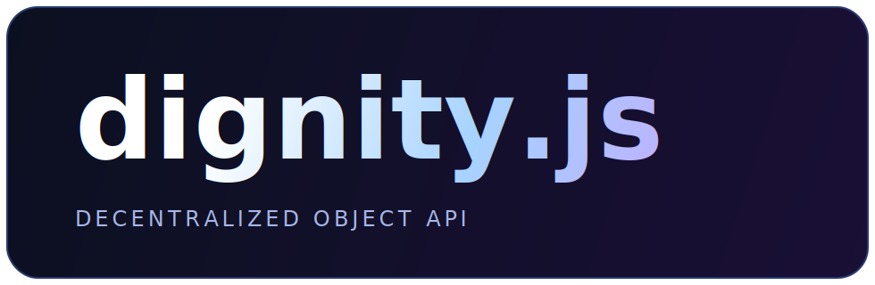

# dignity.js

<p align="center">
  
</p>

<p align="center">
  
  
  
</p>

<p align="center">
  <a href="https://www.npmjs.com/package/dignity.js"></a>
  <a href="https://www.npmjs.com/package/dignity.js"></a>
  
  
  
  
</p>

REST-like P2P object API for decentralized JavaScript applications.

`dignity.js` lets many browsers synchronize shared objects with ownership rules and built-in anti-abuse + privacy controls.

> Logo typography uses a premium editorial serif/sans stack (non-Liberation).

## Highlights

- REST-like API over P2P replication: `create`, `read`, `list`, `update`, `remove`
- Owner authorization model by default (only creator can update/delete)
- Security defaults enabled:
  - message signing (Ed25519)
  - broadcast encryption (shared password)
  - direct encryption (recipient public key)
  - Sloth VDF proof-of-work per message
  - default `powSteps: 22` (calibrated on this machine to about 1000ms)
  - automatic peer ban on invalid signature/PoW (`48h` default)
- Team/subapp scoped broadcast passwords (`broadcastScope` + `broadcastPasswords`)
- Browser-first distribution with minified build (`dist/dignity.min.js`)

## Install

```bash
npm install dignity.js
```

## Quick Start

```js
const {
  DignityP2P,
  InMemoryNetworkHub,
  InMemoryNetworkAdapter
} = require('dignity.js');

const hub = new InMemoryNetworkHub();

const alice = new DignityP2P({
  nodeId: 'alice',
  networkAdapter: new InMemoryNetworkAdapter(hub),
  security: {
    appPassword: 'shared-out-of-band-password',
    powSteps: 22
  }
});

const bob = new DignityP2P({
  nodeId: 'bob',
  networkAdapter: new InMemoryNetworkAdapter(hub),
  security: {
    appPassword: 'shared-out-of-band-password',
    powSteps: 22
  }
});

await alice.start();
await bob.start();

await alice.joinDiscovery('main', {
  metadata: { nickname: 'alice' }
});
await bob.joinDiscovery('main', {
  metadata: { nickname: 'bob' }
});

const visiblePeers = alice.listPeers('main', { includeSelf: false });
console.log('Peers in main room:', visiblePeers.map((peer) => peer.peerId));

await alice.create('notes', { title: 'hello decentralized world' }, {
  id: 'note-1',
  broadcastScope: 'main'
});
console.log(bob.read('notes', 'note-1'));

await alice.leaveDiscovery('main');
await bob.leaveDiscovery('main');
```

## Team / Subapp Scoped Passwords

Use a different broadcast password per cooperative team, room, or sub-application namespace.

```js
const node = new DignityP2P({
  nodeId: 'player-1',
  networkAdapter,
  security: {
    appPassword: 'fallback-password',
    broadcastPasswords: {
      'coop:red': 'red-team-secret',
      'coop:blue': 'blue-team-secret'
    },
    powSteps: 22,
    banDurationMs: 48 * 60 * 60 * 1000
  }
});

await node.create('matches', { mode: 'coop' }, {
  id: 'm-1',
  broadcastScope: 'coop:red'
});
```

Peers with a different password for `coop:red` cannot decrypt that broadcast traffic.

## Room / Team Discovery

Use scoped discovery to find active peers in a room (for example `main`, `team:red`, `raid-42`).

```js
await node.joinDiscovery('team:red', {
  metadata: { nickname: 'alice' },
  heartbeatIntervalMs: 15000,
  ttlMs: 45000
});

const peers = node.listPeers('team:red', { includeSelf: false });
await node.leaveDiscovery('team:red');
```

## Direct Secure Messaging

```js
alice.registerPeerPublicKey('bob', bob.getPublicKey());
bob.registerPeerPublicKey('alice', alice.getPublicKey());

await alice.sendDirectMessage('bob', 'dm', { text: 'private payload' });
```

## Browser Builds

Generated artifacts:

- `dist/dignity.min.js` (IIFE, global `DignityJS`)
- `dist/dignity.esm.js` (ESM)
- `dist/dignity.cjs.js` (CommonJS)

Example with CDN:

```html
<script src="https://unpkg.com/dignity.js/dist/dignity.min.js"></script>
<script>
  const { DignityP2P } = DignityJS;
</script>
```

## Development

```bash
npm test
npm run build
npm run docs:serve
npm run example:tictactoe
npm run example:chess
npm run test:pow-calibrate
```

## Docs and Examples

- Docs site source: `docs/index.html`
- API metadata: `docs/openapi-like.json`
- Minimal demos:
  - `examples/decentralized-tictactoe.js`
  - `examples/decentralized-chess-lite.js`

## Publish

```bash
npm test
npm run build
npm publish --access public
```

## License

Apache 2.0
