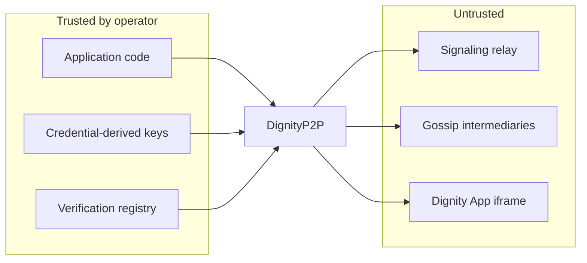

# Threat model (v1.1.0)

Concise STRIDE analysis for dignity.js production deployments. Complements the [production runbook](./production-runbook.md) and automated audits (`tests/unit/security-audit-v060.test.js`, `tests/unit/security-audit-v0130.test.js`, issue #122).

## Scope

| In scope | Out of scope |
|----------|--------------|
| Browser and Node peers using `DignityP2P` | Application business logic bugs |
| Signaling relays (PeerJS / WebSocket) | OS / browser zero-days |
| WebRTC data channels | npm supply-chain attacks |
| Gossip (PeerGroup) fanout | Legal / compliance frameworks |
| IndexedDB persistence | Hosting provider compromise |

**Assumption:** peers run dignity.js ≥ 1.0 with production security options (`appPassword`, scoped `broadcastPasswords`, signing + encryption enabled). Default `DEFAULT_APP_PASSWORD` is never used in production.

## Assets

- **Object data** — replicated records and domain-event views
- **Signing keys** — Ed25519 identity and cold-recovery keys
- **Encryption keys** — Curve25519 box keys and broadcast scope keys
- **Verification registries** — local and publisher-scoped business-logic hashes
- **Presence metadata** — discovery scopes, PeerGroup membership, verification summaries

## STRIDE by attack surface

### 1. Signaling relays

| Threat | Description | Mitigations | Residual risk |
|--------|-------------|-------------|---------------|
| **S** Spoofing | Relay impersonates a peer id | PeerJS id assignment; peers verify signed direct messages | Relay can still deliver malformed frames; dropped if signature/PoW fails |
| **T** Tampering | Relay modifies in-flight signaling | WebRTC DTLS-SRTP for media; app payloads encrypted/signed after channel open | Signaling metadata (peer ids, ICE candidates) visible to relay operator |
| **R** Repudiation | Relay denies delivery | No relay-side audit log in library | Operator logs are external concern |
| **I** Information disclosure | Relay observes peer ids, connection graph | E2E encryption on data channel; broadcast uses scope passwords | Traffic analysis on who connects to whom |
| **D** Denial of service | Relay drops or floods connections | Multi-URL pool + failover (`createDefaultSignalingPool`) | Single relay outage blocks new joins until failover |
| **E** Elevation | Relay injects operations | Operations require valid signatures from known keys; PoW on messages | Weak `appPassword` allows decrypt of broadcast ciphertext |

**Controls:** TLS (`wss://`), custom signaling, TURN for NAT, `RUN_CLOUDFLARE_LIVE_TESTS` smoke on CI.

### 2. Gossip / PeerGroup

| Threat | Description | Mitigations | Residual risk |
|--------|-------------|-------------|---------------|
| **S** Spoofing | Non-member publishes to group | Signed domain events; publisher role for bulk tier | Custom inner `custom` messages are app-defined |
| **T** Tampering | Gossip relay alters event chain | `verifyDomainEvent`, `verifyEventChain`, `chainbroken` event | Replica must verify on ingest |
| **R** Repudiation | Publisher denies write | Signed events with publisher key | Requires trusted publisher key registration |
| **I** Disclosure | Spectator reads private fields | Apps choose public snapshot fields; scoped broadcast passwords | Misconfigured snapshots leak data |
| **D** DoS | Epidemic flood | `maxHops` (default 64), fanout limits, tiered live/bulk caps | Large groups still CPU-bound on verify |
| **E** Elevation | Subscriber executes writes | CQRS replicas are read-only; stored commands require publisher node + verification | Compromised publisher key grants write |

**Controls:** `DignityQueryReplica`, tiered PeerGroups, `registerPublisherVerification`, `policyrejected` events.

### 3. Direct messages

| Threat | Description | Mitigations | Residual risk |
|--------|-------------|-------------|---------------|
| **S** Spoofing | Forged `proposerId` on proposals | Handler binds identity to verified sender, not payload field (#122 audit) | — |
| **T** Tampering | Modified proposal patch | Signature over message; owner validates patch shape | — |
| **I** Disclosure | MITM on data channel | NaCl box to recipient public key | Missing or stale peer public key registration |
| **D** DoS | Message spam | PoW (Sloth VDF), auto-ban (`banDurationMs`), manual `banPeer` | Attacker with GPU time can still consume CPU |
| **E** Elevation | Non-owner applies owner ops | Owner-only `update`/`remove`; proposals require `acceptProposal` | Compromised owner key |

**Controls:** `registerPeerPublicKey`, `securityerror`, `peerbanned`, proposal patch validation (audit v0.13).

### 4. IndexedDB persistence

| Threat | Description | Mitigations | Residual risk |
|--------|-------------|-------------|---------------|
| **I** Disclosure | Local disk read on shared device | Browser origin isolation; no plaintext secrets in IDB for keys if using credential derive + session | Physical access to unlocked browser |
| **T** Tampering | Malicious extension writes IDB | Content hashes on records; verification on restore | Tampered data may load until hash/policy check |
| **D** DoS | Quota exhaustion | `collections` filter on `IndexedDBPersistence` | Large apps need pruning strategy |

**Controls:** `record.hash`, `restoreRecord` warnings, `persistence-failed` warning subtype.

### 5. Identity rotation, cold recovery & mnemonic backup

| Threat | Description | Mitigations | Residual risk |
|--------|-------------|-------------|---------------|
| **S** Spoofing | Fake `identity:rotate` | Signed rotation messages; generation monotonicity (`shouldApplyIdentityRotation`) | — |
| **T** Tampering | Rollback to old generation | Reject lower generations | Stale peers may need manual re-trust |
| **I** Disclosure | Cold recovery password brute force | PBKDF2-SHA256 (`kdfIterations` default 100k) | Weak passwords |
| **I** Disclosure | Plain recovery phrase theft | App UI should blur-by-default; optional `exportIdentityMnemonicEncrypted` for vault storage | Anyone with the 48-word phrase reconstructs signing + encryption keys |
| **E** Elevation | Stolen cold recovery key | `revokeAndRotateDerivedIdentity`; bump generation | Recovery key is powerful by design |
| **E** Elevation | Stolen mnemonic or encrypted blob + passphrase | Treat as full identity compromise; rotate generation | Phrase/passphrase are root secrets by design |

**Controls:** `deriveKeyPairFromCredentials`, `exportIdentityMnemonic` / `importIdentityMnemonic` (#130), encrypted mnemonic helpers, `enrollColdRecoveryPassword`, `broadcastIdentityRotation`.

**Complementary roles:** username/password derive recreates keys; mnemonic backups an existing keyPair offline; cold password blocks rotation lockout — they are not substitutes for each other.

### 6. Dignity Apps (sandboxed iframes)

| Threat | Description | Mitigations | Residual risk |
|--------|-------------|-------------|---------------|
| **E** Elevation | iframe escapes sandbox | `DEFAULT_SANDBOX` = `allow-scripts` only; CSP from manifest | `allow-same-origin` never added by default |
| **T** Tampering | Stored command injects `__proto__` | Dangerous key rejection in `executeStoredCommand` (#122 audit) | Manifest author is trusted |
| **I** Disclosure | iframe reads host DOM | MessageChannel RPC only; no shared origin | Misconfigured CSP `connect-src` |

**Controls:** `validateDignityAppManifest`, `buildAppCsp`, `attachErrorPanel`, publisher verification pins (#123).

### 7. Verification & business logic

| Threat | Description | Mitigations | Residual risk |
|--------|-------------|-------------|---------------|
| **T** Tampering | Divergent rule sets across peers | `registerVerification`, `verificationHash` on records | `advisory` policy allows mismatch with warning only |
| **S** Spoofing | Fake semver with wrong hash | `verification-version-spoof` warning; `strict` policy rejects | Operators must set policy per collection |
| **E** Elevation | Untrusted publisher logic | `registerPublisherVerification` + manifest `logicHash` | Trust is pairwise, not global |

**Controls:** `COMPATIBILITY_POLICIES`, `evaluateVerificationCompatibility`, reflective hashing (#123).

## Trust boundaries

## Residual risks (accepted for v1.1)

1. **Signaling operator visibility** — connection metadata is visible; payload confidentiality depends on E2E crypto and strong passwords.
2. **Advisory verification policy** — default `advisory` logs mismatches but does not block; production apps should choose `strict` or `patch-only` where appropriate.
3. **No global PKI** — peer trust is pairwise (`registerPeerPublicKey`); users must verify out-of-band.
4. **PoW is economic, not absolute** — determined attackers can compute Sloth proofs; bans limit sustained abuse.
5. **Demo apps are not hardened** — chess/tictactoe examples illustrate APIs; production apps must follow the [runbook](./production-runbook.md).

## Security testing

| Suite | Coverage |
|-------|----------|
| `security-audit-v060.test.js` | Core signing, encryption, bans, identity |
| `security-audit-v0130.test.js` | Proposals, stored commands, verification ingest |
| `security-hardening-v070.test.js` | v0.7 hardening regressions |
| `message-security-service.test.js` | PoW, KDF, broadcast/direct crypto |

Run full suite: `npm test`.

## Hardening checklist

- [ ] Replace `DEFAULT_APP_PASSWORD` with strong `appPassword`
- [ ] Set per-room `broadcastPasswords`
- [ ] Deploy TURN for production WebRTC
- [ ] Register verification per collection (`strict` or `patch-only` for financial/stateful data)
- [ ] Subscribe to `securityerror`, `policyrejected`, `chainbroken`, `peerbanned`
- [ ] Use `deriveKeyPairFromCredentials` instead of ephemeral keys where identity matters
- [ ] Review [API stability](./api-stability.md) before pinning to 1.x
